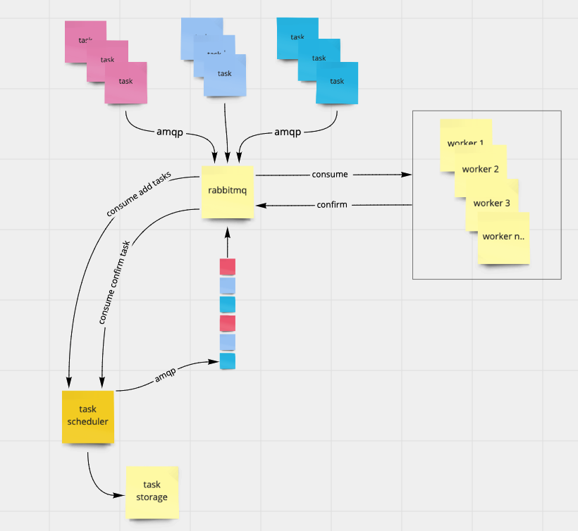

### Competitive AMQP task scheduler service

#### install

##### run in docker

```
docker build -f install/Dockerfile -t competitive-amqp .
```

```
docker run -it --rm -p 80:80 -e NODE_ENV=production competitive-amqp
```

#### queue configuration

##### default yaml config

```yaml
ns:
  - inbox: inbox1
    outbox: outbox1
    confirm: confirm1
    inboxPrefetch: 250
    confirmPrefetch: 1
  - inbox: inbox2
    outbox: outbox2
    confirm: confirm2
    inboxPrefetch: 250
    confirmPrefetch: 1
```

#### architecture


